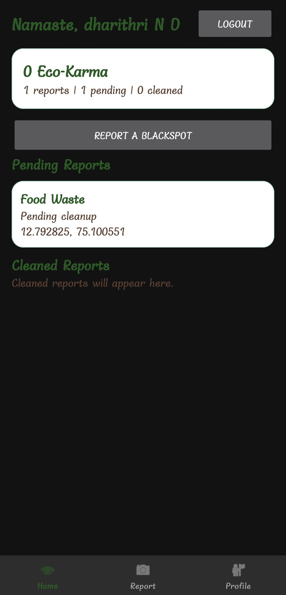
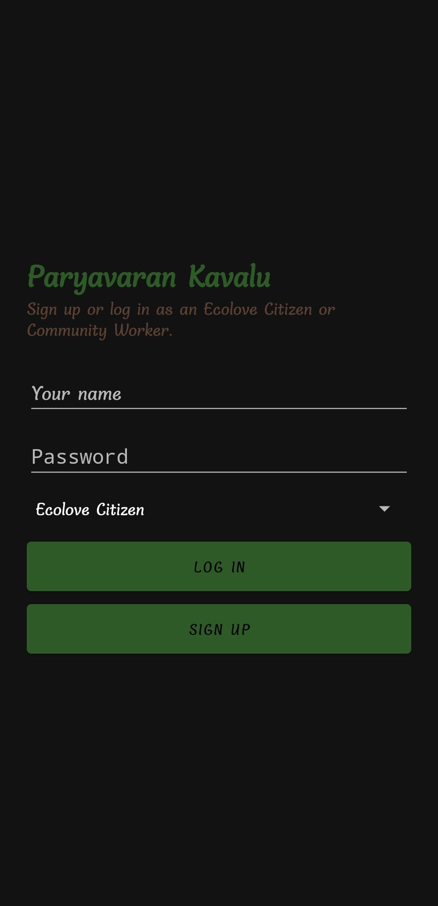
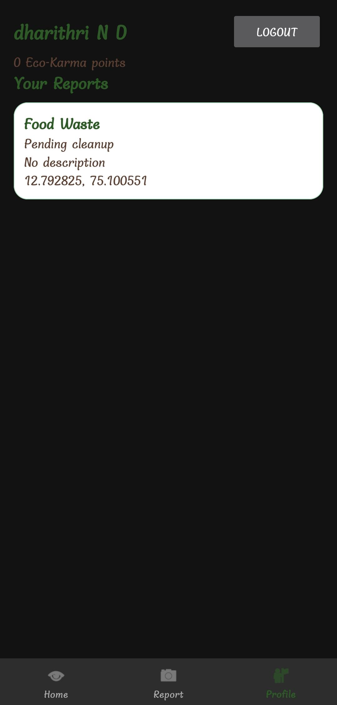
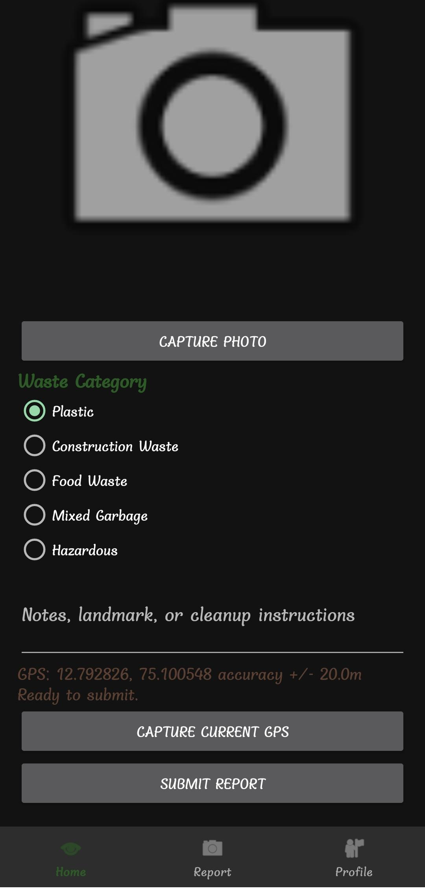

# Paryavaran-Kavalu

An Android application developed using Kotlin to report illegal garbage dumping locations using GPS and Google Maps.

## Problem Statement
Illegal garbage dumping creates environmental and health problems. Volunteers often miss these waste blackspots due to lack of centralized reporting.

## Features
- Waste reporting system
- GPS location tracking
- Google Maps integration
- Image upload support
- Volunteer assistance

## Technologies Used
- Kotlin
- Android Studio
- Firebase
- Google Maps API
- XML

## Installation
1. Clone the repository
2. Open in Android Studio
3. Sync Gradle
4. Run the app

## Future Improvements
- AI waste detection
- Admin dashboard
- Real-time analytics

## Project Demo Video

[Watch Demo Video Here](https://drive.google.com/file/d/1g76TGgzLq2mKYVWgn6Z85CcyaxpbPqvY/view?usp=drive_link)

## Screenshots

